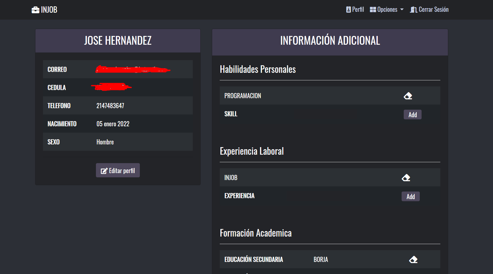
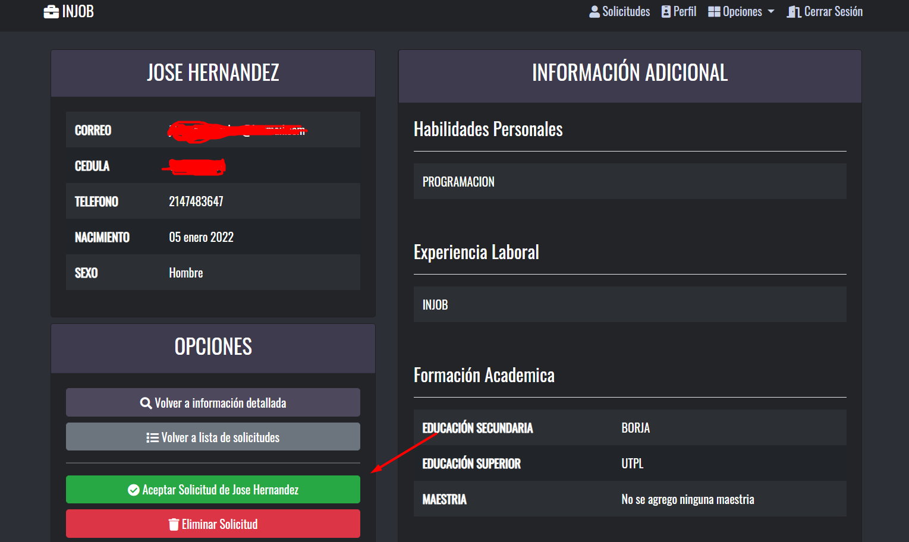
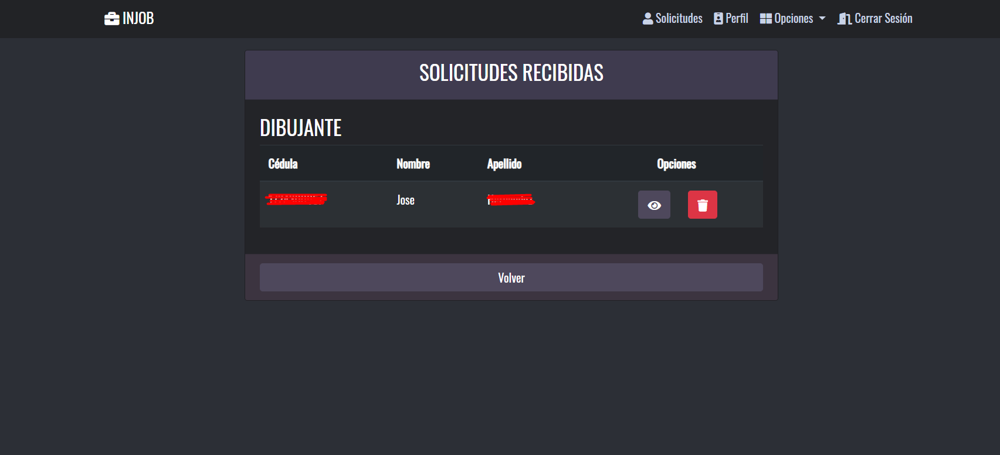

# **INJOB**


---
## **Acerca de**
Este es un servicio dedicado a la busqueda de empleos, valorando a estos en base a su empresa. El prestigio de la emrpesa nos ayudará a evitar posibles fraudes a la hora de seleccionar un empleo.

---
## **Instalación**
Para poder instalar la app solo se debe seguir los siguentes pasos:
1. Copiar el repositorio.
2. Instalar las dependencias con el comando ```npm i``` esto instalará las dependencias necesarias.
3. Crear nuestra base de datos en mysql. (La estructura se encuentra dentro del proyecto en la sección resources/database/db.sql).
4. Configurar las variables de entorno. (Las variables de entorno son las que usamos para ingresar a la base de datos). 
**Nota:** Para configurar las variables de entorno de manera local, se debe crear un archivo .env en la raiz del proyecto.
---
## **Variables de entorno**
### **Base de datos**
|Nombre de la variable|           Uso                 |
|---------------------|-------------------------------|
|USER_DB              |Nombre de usuario de la bd     |
|HOST_DB              |Nombre del host de la bd       |
|PASSWORD_DB          |Contraseña de la bd            |
|DB_NOMBRE            |Nombre de la bd que accederemos|

``` javascript
    conectionLimit: 10,
    host: process.env.HOST_DB,
    user: process.env.USER_DB,
    password: process.env.PASSWORD_DB,
    database: process.env.DB_NOMBRE
```
### **Correo electronico**
|Nombre de la variable|           Uso                           |
|---------------------|-----------------------------------------|
|USER_ACCOUNT         |Nombre del correo que enviara las alertas|
|CLIENT_ID            |Datos de autenticacion OAuth             |
|CLIENT_SECRET        |Datos de autenticacion OAuth             |
|REDIRECT_URI         |Datos de autenticacion OAuth             |
|REFRESH_TOKEN        |Datos de autenticacion OAuth             |

``` javascript
    const accessToken = async() =>{
        const oAuth2Client = new google.auth.OAuth2(
            process.env.CLIENT_ID,
            process.env.CLIENT_SECRET,
            process.env.REDIRECT_URI
        );
        oAuth2Client.setCredentials({refresh_token:process.env.REFRESH_TOKEN});
        return await oAuth2Client.getAccessToken();
    }
```


**Nota:**  Los datos para oAuth se pueden obtener al configurar la api. Puedes configurar la api para el proyecto desde [aquí](https://console.cloud.google.com/apis "Configurar api para correo electronico") (configurar api) y [aquí](https://developers.google.com/oauthplayground) (configurar los tokens para la api de mail)

**Nota2:** Todas las configuraciones a la que acceden las variables de entorno se encuentran en la carpeta config.

---
## **Capturas del sitio**
**Login**

**Registro**

**Página principal**

**Valoración de la empresa**

**Reportar empresa ***empleado*****

**Perfil**

**Solicitud de empleo**

**Lista de solicitudes**
